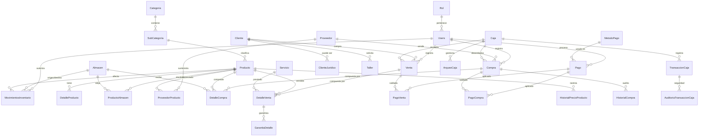

# Sistema de Gestión de Básculas (DB_Basculas)

Este proyecto contiene la infraestructura y el esquema de base de datos para un sistema de gestión integral de básculas, abarcando desde el control de inventario y ventas hasta el mantenimiento en taller y la gestión financiera de caja.

## 🚀 Tecnologías Utilizadas

- **Base de Datos**: Microsoft SQL Server (MSSQL) 2022.
- **Contenedorización**: Docker con Docker Compose.
- **Lenguaje**: T-SQL.

---

## 📊 Arquitectura del Sistema

El sistema está diseñado modularmente para garantizar escalabilidad, seguridad y trazabilidad total de las operaciones.

### 🔐 1. Seguridad y Acceso
Gestión de permisos basada en roles para asegurar la integridad de la información.
- **`Rol`**: Define los niveles de acceso (Administrador, Vendedor, Técnico, Almacenista).
- **`Users`**: Usuarios del sistema con contraseñas encriptadas mediante `HASHBYTES` (SHA2_256).

### 📦 2. Gestión de Inventario
Control exhaustivo de existencias distribuidas y catalogación jerárquica.
- **`Almacen`**: Ubicaciones físicas donde se resguardan los productos.
- **`Categoria` & `SubCategoria`**: Clasificación organizada para facilitar búsquedas y reportes.
- **`Producto`**: Maestro de artículos (básculas y repuestos).
- **`DetalleProducto`**: Precios de compra/venta y alertas de stock mínimo.
- **`ProductoAlmacen`**: Control de stock específico por cada ubicación física.

### 🛒 3. Compras y Proveedores
Ciclo completo de adquisición y abastecimiento.
- **`Proveedor`**: Ficha técnica y de contacto de socios comerciales.
- **`ProveedorProducto`**: Relación de qué proveedor surte qué productos.
- **`Compra` & `DetalleCompra`**: Registro de facturación de compra y recepción detallada.
- **`MovimientosInventario`**: Auditoría en tiempo real de entradas, salidas y ajustes manuales.

### 💰 4. Clientes y Ventas
Gestión comercial orientada al cliente y seguimiento post-venta.
- **`Cliente` & `ClienteJuridico`**: Registro detallado de personas naturales y empresas (RUC).
- **`Venta` & `DetalleVenta`**: Procesamiento de transacciones comerciales de bienes y servicios.
- **`GarantiaDetalle`**: Seguimiento automático de periodos de garantía por cada artículo vendido.

### 🛠️ 5. Taller y Servicios
Módulo de servicios técnicos y reparaciones.
- **`Servicio`**: Catálogo de mano de obra (calibración, reparación, mantenimiento).
- **`Taller`**: Gestión de equipos de clientes que ingresan para intervención técnica.

### 🏦 6. Gestión de Caja y Finanzas
Control riguroso del flujo de efectivo y auditoría transaccional.
- **`Caja`**: Terminales o puntos de recaudación físicos.
- **`ArqueoCaja`**: Procesos de apertura, cierre y conciliación de diferencias.
- **`TransaccionCaja`**: Registro pormenorizado de cada ingreso y egreso vinculado a la caja.
- **`Pago` & `MetodoPago`**: Centralización de cobros (Efectivo, Tarjeta, Transferencia).
- **`PagoVenta` & `PagoCompra`**: Tablas de vínculo para saldar transacciones comerciales.

---

## Diagrama de Base de Datos (ER)

Refleja la estructura completa del sistema, incluyendo los flujos de auditoría y gestión de caja.



---

## 📂 Estructura del repositorio

- `DB_Basculas.sql`: Definiciones DDL (tablas, relaciones, constraints).
- `inserts.sql`: Carga masiva de datos iniciales y catálogos.
- `procedures/`: Directorio organizado por módulos con toda la lógica CRUD y procesos de negocio.
- `Triggers/`: Disparadores para automatización de stock e historiales de auditoría.
- `views/`: Vistas predefinidas para reportes financieros y operativos.
- `compose.yml` & `dockerfile`: Infraestructura como código para despliegue rápido.

---

## 🛠️ Instalación y Despliegue

### Requisitos
- Docker instalados.
    - [Para Windows](https://docs.docker.com/desktop/setup/install/windows-install/)
    - [Para Ubuntu](https://docs.docker.com/desktop/setup/install/linux/)
      
> [!TIP]
> Por cualquier error en la instlación consultar [youtube](https://www.youtube.com/).   

---

### Instalación
1. **Iniciar el Servidor**:
   ```bash
   docker compose up -d
   ```
   
> [!NOTE]
> *El sistema detectará automáticamente el esquema y cargará los procedimientos, disparadores, vistas y datos maestros al iniciar por primera vez.*

1. **Conexión**:
   Utilice **Azure Data Studio** (recomendado). También puede conectarse desde su **IDE** preferido o mediante **SQL Server Management Studio (SSMS)** apuntando a `localhost:1433`, utilizando las credenciales definidas en el archivo `compose.yml`.

> [!TIP]
> Si quieres apagar el contenedor ejecuta: `docker compose down`   

---

## 🔒 Auditoría y Seguridad
- **Historiales**: El sistema nunca elimina datos sensibles; en su lugar, utiliza tablas de historial (`HistorialPrecioProducto`, `HistorialCompra`) y campos de `DateDelete`.
- **Integridad**: Todas las transacciones financieras están vinculadas a un usuario y una caja específica para control de fraude.
